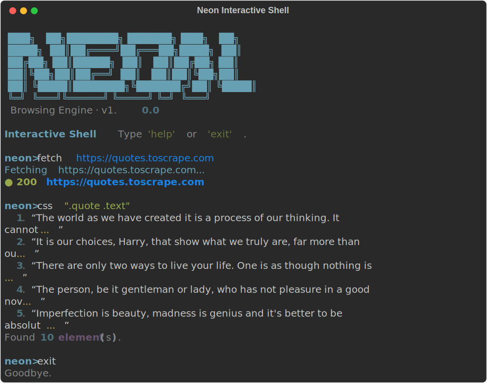

# ⚡ Neon — Browsing Engine

> A Python **web scraping framework.** 
> Inspired by [Scrapling](https://github.com/D4Vinci/Scrapling), [Playwright](https://playwright.dev/), and [Firecrawl](https://firecrawl.dev/).

## Demo



---

## Features

| Feature | Details |
|---|---|
| **Three-tier fetcher** | Static (httpx) → Stealth (Playwright + patches) → Dynamic (full browser) |
| **Auto-escalation** | Automatically upgrades to browser mode when blocked |
| **CSS & XPath** | Rich element selection, just like BeautifulSoup / Scrapy |
| **Link extraction** | Deduplicated, absolute-URL resolved |
| **Markdown export** | Firecrawl-style HTML → Markdown conversion |
| **Spider API** | Scrapy-like spider with BFS crawling |
| **Sessions** | Cookie persistence across requests |
| **Interactive CLI** | REPL shell + `fetch`, `scrape`, `links` commands |

---

## Installation

```bash
# Create and activate venv
python -m venv venv
source venv/bin/activate        # Linux/macOS
# venv\Scripts\activate         # Windows

# Install core dependencies
pip install httpx lxml cssselect markdownify click rich

# Optional: browser support (stealth + dynamic modes)
pip install playwright
playwright install chromium
```

Or install everything at once:
```bash
pip install -e ".[all]"
playwright install chromium
```

---

## Quick Start

### Python API

```python
from neon import NeonEngine, Scraper, Spider

# --- One-line fetch ---
result = NeonEngine.get("https://example.com")
print(result.css("h1")[0].text)
print(result.to_markdown())

# --- Scraper (auto-escalating) ---
scraper = Scraper()
result  = scraper.get("https://quotes.toscrape.com")
quotes  = [el.text for el in result.css(".quote .text")]

# --- Session (persistent cookies) ---
from neon import NeonSession
with NeonSession(mode="static") as session:
    page  = session.get("https://example.com")
    page2 = session.get("https://example.com/page2")  # cookies carried

# --- Spider ---
class MySpider(Spider):
    start_urls = ["https://quotes.toscrape.com/"]
    mode = "static"

    def parse(self, result):
        for q, a in zip(result.css(".quote .text"), result.css(".quote .author")):
            yield {"quote": q.text, "author": a.text}
        next_btn = result.css(".next a")
        if next_btn:
            yield next_btn[0].get("href")

data = MySpider().start()
print(f"Scraped {len(data)} quotes")
```

### CLI

```bash
# Fetch a page (text output)
python -m neon.cli fetch https://example.com

# Fetch as Markdown
python -m neon.cli fetch https://example.com --markdown

# Scrape with a CSS selector
python -m neon.cli scrape https://quotes.toscrape.com --css ".quote .text"

# Extract links
python -m neon.cli links https://example.com

# Interactive shell
python -m neon.cli shell
```

---

## Fetcher Modes

| Mode | Description | Use When |
|------|-------------|----------|
| `static` | Fast HTTP via `httpx` + browser headers | Static HTML pages, APIs |
| `stealth` | Playwright headless + stealth patches | Cloudflare, basic bot walls |
| `dynamic` | Full Playwright browser + JS | SPAs, heavy JS sites |
| `auto` | Auto-escalates through tiers | **Default** — best for most cases |

---

## Project Structure

```
neon/
├── __init__.py      # Public API
├── engine.py        # NeonEngine coordinator
├── fetchers.py      # StaticFetcher, StealthFetcher, DynamicFetcher
├── parser.py        # NeonParser (CSS, XPath, text, markdown, JSON)
├── scraper.py       # Scraper, Spider
├── session.py       # NeonSession (persistent state)
├── cli.py           # Interactive CLI
└── utils.py         # Headers, URL tools, block detection
```
